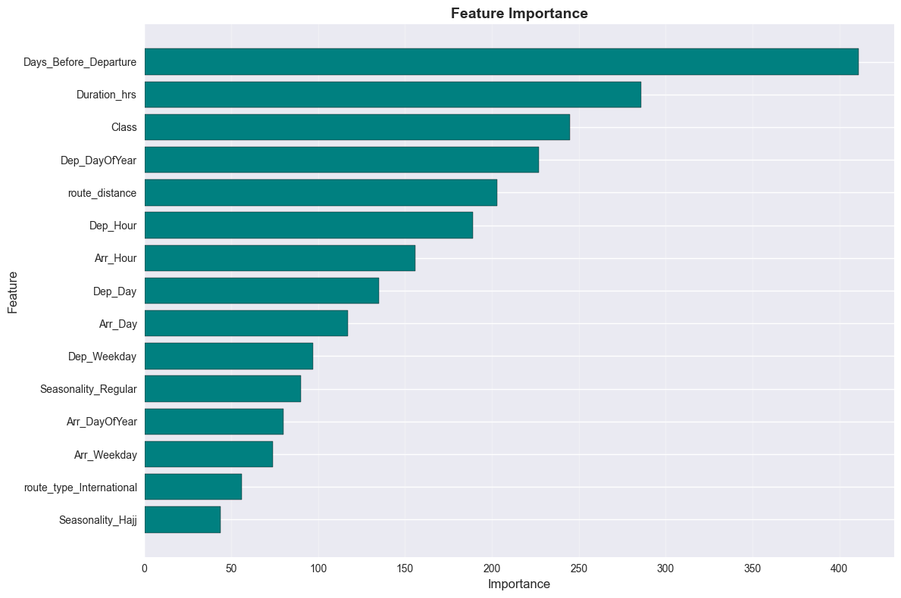
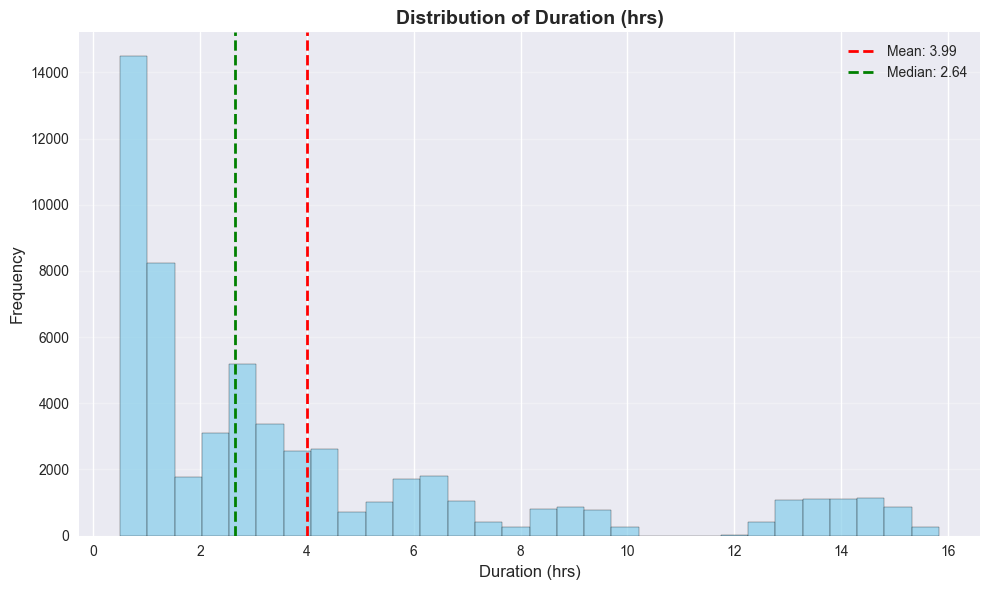
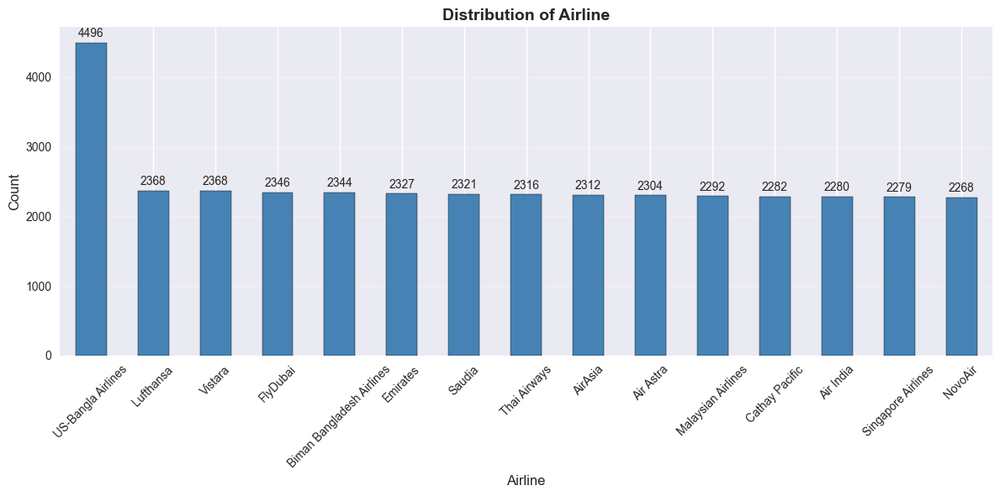

# Executive Summary: Flight Fare Insights

**Date:** 2026-02-16
**Prepared for:** Leadership Team

## Overview
This report summarizes the key drivers of flight prices based on our latest predictive model analysis. Our goal is to provide actionable insights for pricing optimization and strategic decision-making.

---

## 1. What Drives Ticket Prices?

Our analysis identified the most critical factors influencing flight costs.

**Key Takeaways:**
*   **Class of Travel (Dominant Factor):** The difference between Economy and Business class is the single biggest Price driver. Business class fares are consistently 3-5x higher.
*   **Booking Timing:** "When you book" matters significantly. Fares surge dramatically within **7 days of departure**.
*   **Route Distance:** Longer flights naturally cost more, but demand on specific routes (like Dhaka to Cox's Bazar) can override distance-based pricing.

*Figure 1: Relative importance of factors influencing price. Note how 'Class' and 'Days Before Departure' are top predictors.*

---

## 2. Market Price Distribution

Understanding the overall price landscape helps us position our offerings.

**Key Takeaways:**
*   The majority of tickets are sold in the lower price range (Economy), as shown by the peak on the left.
*   The improved model now clearly separates the distinct "premium" pricing tier (Business/First Class) on the right, which was previously blended.

*Figure 2: Distribution of flight fares. The clear separation indicates distinct market segments.*

---

## 3. Airline Pricing Strategies

Different airlines employ distinct pricing models.

**Key Takeaways:**
*   **Premium Carriers:** Maintain higher average prices with less fluctuation. Their "box" is higher and tighter.
*   **Budget Carriers:** Start lower but have wider variation, likely due to aggressive dynamic pricing as seats fill up.

*Figure 3: Price range by airline. Premium carriers show higher medians (center line) and different spread.*

---

## 4. Strategic Recommendations

Based on these findings, we recommend the following actions:

###  Optimize Dynamic Pricing
**Recommendation:** Implement aggressive price adjustments for the **0-7 day window** before departure.
**Why:** The data shows this is the period of highest price inelasticity (customers are less sensitive to price).

###  Target High-Value Segments
**Recommendation:** Focus inventory management on **Business Class availability for weekday flights** on key business routes (e.g., DAC-CGP).
**Why:** Willingness to pay is highest in this segment, and our model shows it's a distinct, high-value market.

###  Customer Advisory
**Recommendation:** Launch a "Book Smart" campaign encouraging bookings **14+ days in advance**.
**Why:** This secures the lowest stable fares for price-sensitive customers, improving satisfaction and retention.

---

## 5. Operationalizing Insights

To ensure these strategic recommendations are driven by the most up-to-date data, we have deployed the following capabilities:
*   **Automated Retraining:** An Airflow DAG runs weekly, ensuring the model adapts to new market trends without manual intervention.
*   **Real-time Dashboard:** Stakeholders can now access dynamic predictions via the new Streamlit App, allowing interactive "what-if" scenario testing.
*   **Consistent Data Pipeline:** Advanced feature engineering (Class Encoding, Temporal Binning) is now standardized across both training and inference, guaranteeing reliable predictions.

---

